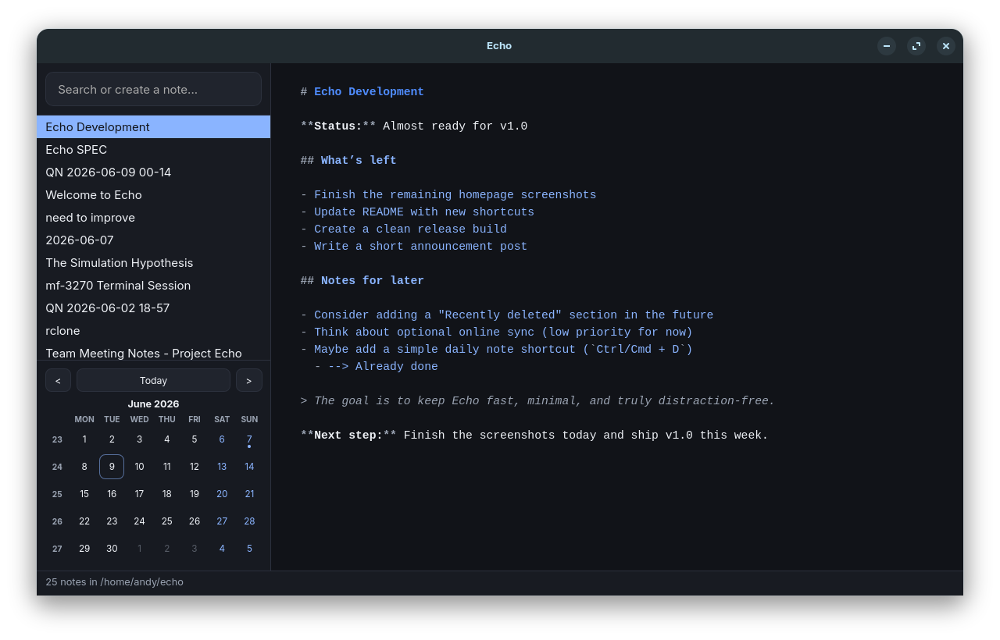
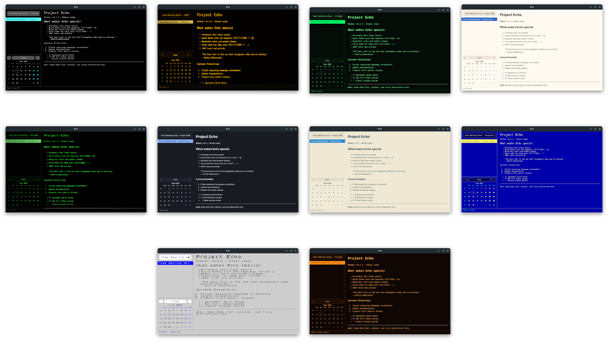
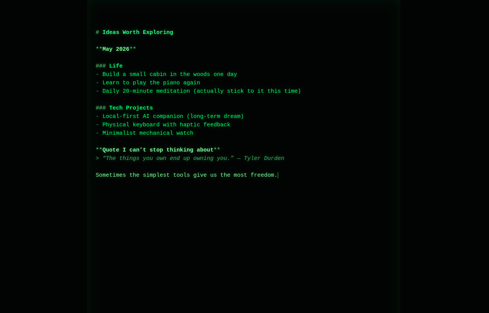
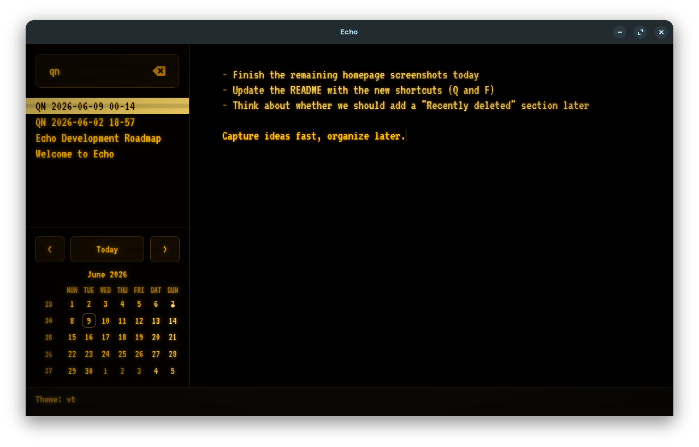
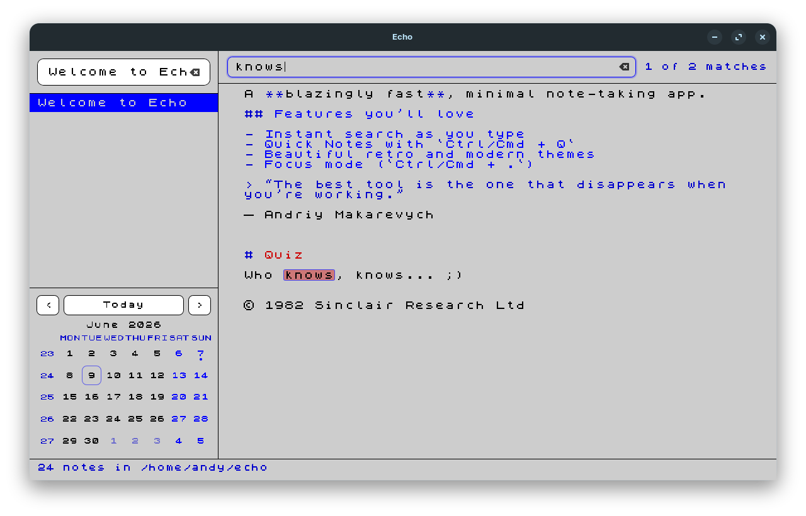
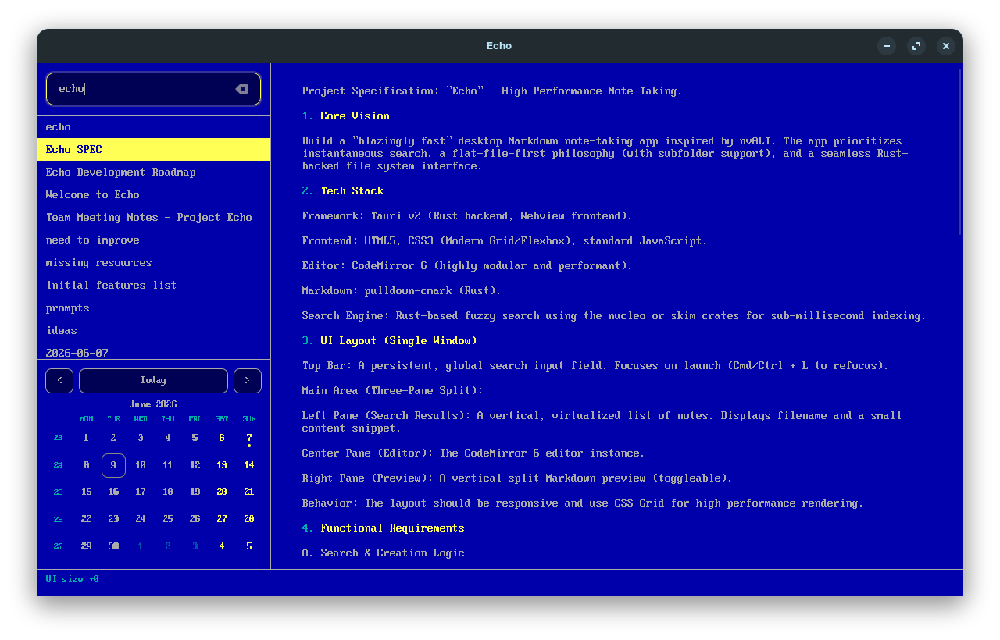
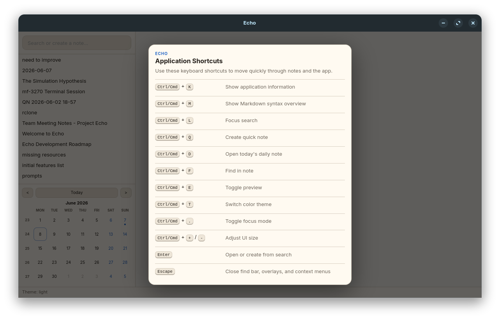
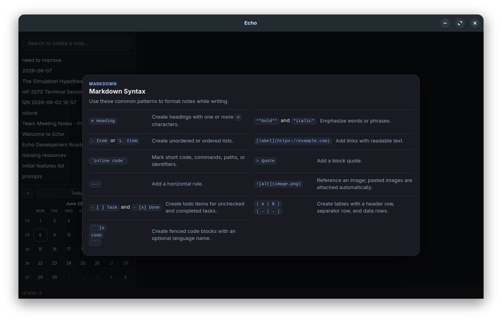

# Echo

**A blazingly fast, minimal, distraction-free note-taking app.**

Built for focus. Designed for flow.

Echo gets out of your way so you can think clearly and do your **real work**.

## Features

- ⚡ Blazing fast startup and search (Rust + Tauri)
- 📝 Clean Markdown editing with live preview
- 🔎 Improved fuzzy search — typo-tolerant matching across titles, paths, and content
- ⚡ Quick notes with `Ctrl/Cmd+Q` — timestamped note in one keystroke
- 🔍 Find in note with `Ctrl/Cmd+F` — search inside the open editor
- 📅 Daily notes with built-in calendar and `Ctrl/Cmd+D`
- 🪟 Focus mode (`Ctrl/Cmd+.`) for a distraction-free full-screen canvas
- 🎨 **10 color themes** — dark, light, solarized, hacker, orange-hacker, plus five retro terminal themes (`vga-437`, `vga-blue`, `speccy`, `vt`, `mf-3270`)
- 📁 Plain `.md` files in any folder — no database, no lock-in
- ⌨️ Keyboard-first workflow (`Ctrl/Cmd+K` for shortcuts)
- 🌍 Cross-platform (Windows, macOS, Linux)

## Screenshots

**Main workspace**  

**All themes**  

**Focus mode**  

**Quick note**  

**Find in note**  

**Fuzzy search**  

**Keyboard shortcuts**  

**Markdown syntax help**  

## Download

**Latest version (v0.1.3)**

- **Official website**: [echoedit.app](https://echoedit.app) (recommended)
- **GitHub Releases**: [v0.1.3](https://github.com/giantvoid/echo/releases/latest)

## Tech Stack

- **Frontend**: HTML, CSS, JavaScript (Vite)
- **Backend**: Tauri 2 + Rust
- **Storage**: Plain `.md` files

## Fonts

Echo uses several free and open fonts for its retro terminal themes:

| Font | Used in theme | Source |
|------|---------------|--------|
| [Modern DOS](https://www.dafont.com/modern-dos.font) | `vga-blue` | [dafont.com/modern-dos](https://www.dafont.com/modern-dos.font) |
| [BlockZone](https://github.com/ansilove/BlockZone) | `vga-437` | [github.com/ansilove/BlockZone](https://github.com/ansilove/BlockZone) |
| [zx-spectrum-unicode-font](https://github.com/jfsebastian/zx-spectrum-unicode-font) | `speccy` | [github.com/jfsebastian/zx-spectrum-unicode-font](https://github.com/jfsebastian/zx-spectrum-unicode-font) |
| [VT323](https://fonts.google.com/specimen/VT323) | `vt` | [Google Fonts — VT323](https://fonts.google.com/specimen/VT323) |
| [3270font](https://github.com/rbanffy/3270font) | `mf-3270` | [github.com/rbanffy/3270font](https://github.com/rbanffy/3270font) |

For more information about each font’s authors and license terms, see the pages listed in the **Source** column above.

## License

MIT © Andriy Makarevych
